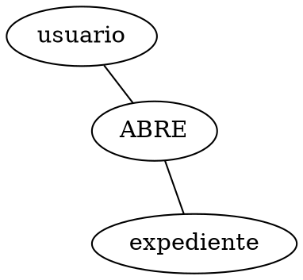

# Herramientas de diagramacion por tipo de entregable

## Resumen por tipo de entregable

| Entregable                                  | Herramienta                        | Notas                                                                                                                                                                                                                                                                                                                                                                                                                                          |
| ------------------------------------------- | ---------------------------------- | ---------------------------------------------------------------------------------------------------------------------------------------------------------------------------------------------------------------------------------------------------------------------------------------------------------------------------------------------------------------------------------------------------------------------------------------------- |
| DER conceptual (Chen)                       | Graphviz (`neato`)                 | Estandar Chen, soporta `shape=box`/`diamond`/`ellipse` nativamente, cardinalidad como label `1`/`n` en aristas. Usar `layout=neato` con aristas `--` (no dirigidas, sin flechas curvas). Sin colores: solo `style=filled, color=lightgrey` en rombos, blanco en entidades y atributos.                                                                                                                                                         |
| Modelo relacional fisico                    | ChartDB (visor, no export)         | El usuario abre ChartDB en navegador e importa `assets/chartdb_diagram.json`. NO se automatiza export PNG. Solo Sprint 0.                                                                                                                                                                                                                                                                                                                      |
| Diagrama Componentes UML                    | PlantUML (component)               | UML 2.5.1 nativo, usa `actor` para usuarios, `interface` con lollipop para puertos.                                                                                                                                                                                                                                                                                                                                                            |
| Casos de Uso Expandido                      | PlantUML (usecase) **o draw.io**   | UML 2.5.1 nativo. **Obligatorio**: `left to right direction`, `skinparam linetype ortho`, `skinparam actorStyle Hollow`. Usar `package` para agrupar actores y flechas direccionales (`-left->`, `-right->`, `-up->`, `-down->`) para posicionamiento preciso. **Alternativa draw.io** (si el usuario la pide): XML draw.io con la misma paleta ambar y Georgia (ver `assets/plantilla-drawio-caso-uso.md`), export PNG con `drawio --export`. |
| Diagrama de Actividades                     | PlantUML (activity, swimlanes)     | UML 2.5.1 nativo.                                                                                                                                                                                                                                                                                                                                                                                                                              |
| Diagrama de Secuencia                       | PlantUML (sequence)                | UML 2.5.1 nativo.                                                                                                                                                                                                                                                                                                                                                                                                                              |
| Tablas                                      | Markdown                           |                                                                                                                                                                                                                                                                                                                                                                                                                                                |
| Mockups UI (estructura)                     | HTML/CSS + OpenPencil + Playwright | HTML/CSS basado en la interfaz real; importar a `.fig`, validar y capturar PNG.                                                                                                                                                                                                                                                                                                                                                                |
| Capturas Interfaz Real (detalles)           | Live browser impeccable/Playwright | Captura de elementos específicos en funcionamiento.                                                                                                                                                                                                                                                                                                                                                                                            |
| Capturas de Scripts de Codigo (snippets)    | Silicon (Aloxaf/silicon)           | CLI Rust, convierte codigo a PNG.                                                                                                                                                                                                                                                                                                                                                                                                              |
| Captura esquema BD relacional (Sprint 0)    | Usuario (psql)                     | Skill explica pasos al usuario; NO se embebe placeholder en el Word.                                                                                                                                                                                                                                                                                                                                                                           |
| Captura colecciones BD vectorial (Sprint 0) | Usuario (Qdrant dashboard)         | Skill explica pasos al usuario; NO se embebe placeholder en el Word.                                                                                                                                                                                                                                                                                                                                                                           |

**Prohibido**: dbdiagram.io (web), Excalidraw, Carbon, ray.so, Mermaid (`mmdc`), bocetos de arquitectura a mano.

## Justificacion

### Graphviz (`neato`) para DER conceptual

Estandar de la industria para diagramas ER con notacion Chen. El layout `neato` produce aristas no dirigidas (sin flechas curvas) y distribucion organica, a diferencia de `dot` que genera layout jerarquico con flechas.

Soporta nativamente las formas de Chen:

- `shape=box` para entidades
- `shape=diamond` para relaciones
- `shape=ellipse` para atributos

Sintaxis canonica (Graphviz gallery `/Gallery/neato/ER.html`):



**Sin colores**: los rombos usan `style=filled, color=lightgrey` o `fillcolor=white` (gris claro o blanco), las entidades y atributos quedan con `fillcolor=white`. No se aplica paleta multiple (`#E8F0FE`/`#FEF3C7`/`#F3F4F6`/`#D1FAE5`) en el DER conceptual — esa paleta solo aplica a diagramas UML.

**Convencion de nombres (DER Chen)**: TODO en minuscula. Entidades, atributos y relaciones usan `snake_case` en minuscula (ej. `chat_privado`, `nivel_jerarquico`). Los rombos de relaciones llevan un **solo verbo** en minuscula como label, sin sufijo ni multilinea (ej. `abre`, `posee`, `indexa`), aunque el identificador del nodo pueda ser desambiguador (`adjunta_msg`, `adjunta_doc`, `contiene_norma`, `contiene_obra`) el label visible es siempre un verbo unico. Los identificadores de nodos pueden ser snakes desambiguadores, pero el `[label="..."]` que se renderiza es un solo verbo en minuscula.

#### Parametros de layout afinables (neato)

El DER conceptual del Sprint 0A se ajusta manualmente con estos parametros globales al inicio del `graph`. Si el layout queda muy abierto o con cruces, modificar estos valores y re-renderizar hasta que se vea claro:

```dot
graph ER_NOMBRE {
    layout=neato;
    overlap=prism;     // reacomoda nodos sin escalar el espacio (mejor que "scale")
    splines=true;      // aristas curvas suaves para evitar superposicion
    K=1;               // fuerza de repulsion: bajar para compactar, subir para abrir
    compound=true;
    node [fontname="Arial", fontsize=12, style=filled, fillcolor=white];
    edge [fontname="Arial", fontsize=10, len=1.3]; // longitud preferida de arista en pulgadas
    // ...
}
```

| Parametro                                   | Funcion                                     | Como ajustar                                                                     |
| ------------------------------------------- | ------------------------------------------- | -------------------------------------------------------------------------------- |
| `K` (global)                                | Fuerza de repulsion entre nodos             | Bajar (`K=0.8`) compacta; subir (`K=1.5`) abre                                   |
| `len` (por arista o global en `edge [...]`) | Longitud preferida de la arista en pulgadas | Aumentar (`len=2.0`) estira una arista especifica; reducir (`len=1.0`) la acorta |
| `overlap`                                   | Evita superposicion de nodos                | `prism` (recomendado), `false`, `scalexy`                                        |
| `splines`                                   | Curvado de aristas                          | `true` curvas suaves, `false` rectas                                             |

**Flujo de ajuste manual**:

1. Generar `.dot` con `K=1`, `len=1.3` global
2. Renderizar: `neato -Tpng der.dot -o der.png`
3. Si hay cruces o nodos muy abiertos: subir/bajar `K` global, o ajustar `len` por arista problematica (ej. `[len=2.0]` para aristas largas con atributos)
4. Re-renderizar. Iterar hasta 3-4 veces. No automatizar — es ajuste visual humano.

Renderizado a PNG localmente:

```bash
neato -Tpng archivo.dot -o out.png
```

Limitaciones asumidas: `neato` emplea randomizacion por defecto, el layout puede variar entre corridas si no se fija `seed`. `overlap=prism` y `K=1` reducen la variabilidad. El ajuste de `len` por arista es manual: no existe auto-layout perfecto para DER Chen con muchos atributos.

### PlantUML obligatorio para UML

Soporta los 14 tipos UML 2.5.1 completos. Requiere `java` (instalado).

```bash
plantuml -tpng archivo.puml
```

#### Notacion UML 2 para Diagrama de Componentes (Sprint 0)

Elementos correctos:

- `actor` para usuarios externos (no `component`)
- `component` solo para modulos internos del sistema
- `interface` con lollipop `()` para puertos proporcionados/requeridos
- `database` para almacenes de datos (PG, Qdrant)
- `package` para agrupar modulos
- `-->` asociacion, `..>` dependencia, `()--()` interfaz requerida

### ChartDB como visor (Sprint 0 unicamente)

La base de datos es la fuente de la verdad (migraciones Alembic). ChartDB importa el esquema real y permite explorarlo interactivamente. **NO se automatiza el export PNG** porque:

1. ChartDB no expone CLI para exportar
2. La UI web es compleja de automatizar (limites en Monaco editor, validación Zod estricta)
3. Para el proposito de la tesis, **basta con que el usuario pueda abrir el modelo** y revisarlo

El JSON `chartdb_diagram.json` vive en `sprints/sprint-0/assets/` como artefacto reproducible del sprint. Se regenera si el usuario lo solicita explicitamente.

#### Pasos para abrir el modelo E-R fisico (instrucciones al usuario)

El `.md` de `modelo-entidad-relacion.md` lleva estos pasos en su cuerpo (es la unica excepcion donde bloques ` ```bash ` van al cuerpo del Word, porque son instrucciones utiles para el lector):

```bash
# 1. Asegurarse de que el JSON existe
ls sprints/sprint-0/assets/chartdb_diagram.json

# 2. Levantar ChartDB (contenedor separado, NO docker-compose del proyecto)
docker run -d --name chartdb-temp -p 127.0.0.1:8080:80 --rm ghcr.io/chartdb/chartdb:latest

# 3. Abrir en navegador
# http://localhost:8080

# 4. Click en "Import from File"
# 5. Seleccionar sprints/sprint-0/assets/chartdb_diagram.json
# 6. ChartDB renderiza el modelo fisico con 19 tablas de dominio y 36 relaciones
# 7. El usuario puede reordenar las tablas visualmente (drag & drop) y
#    guardar el layout sobrescribiendo el JSON original con Export > Download JSON
#    sobre sprints/sprint-0/assets/chartdb_diagram.json
```

El usuario saca su propia captura si lo desea; la skill NO la guarda automaticamente. Para cerrar la Figura 47, debe guardar una captura del modelo visible en ChartDB como `sprints/sprint-0/capturas/modelo-entidad-relacion.png`.

### PlantUML para Casos de Uso Expandido (Sprints 1, 2, 4, 5, 6)

**Configuracion obligatoria** para todos los diagramas de casos de uso expandidos (ver `assets/plantillas-puml.md` para plantilla canonica completa):

```plantuml
@startuml <id-diagrama>
left to right direction
skinparam shadowing false
skinparam linetype ortho
skinparam defaultFontName "Georgia"
skinparam defaultFontColor #4A3B1F

skinparam actor {
    BackgroundColor #FDE68A
    BorderColor #78350F
    FontColor #4A3B1F
}
skinparam usecase {
    BackgroundColor #FFF7D6
    BorderColor #92400E
    FontColor #4A3B1F
}
skinparam rectangle {
    BackgroundColor #FFFBEB
    BorderColor #92400E
    FontColor #4A3B1F
}
@enduml
```

**Reglas de etiquetas** (conforme a teoria UML 2.5.1 y `assets/patrones-redaccion.md`):

- **Sin `title`** dentro del `.puml` (Hard Rule 16). El titulo vive en el H2 del `.md`.
- **`linetype ortho`** para lineas rectas (Hard Rule 17).
- **Actores FUERA del `rectangle`** del modulo (Hard Rule 18). Solo los `usecase` van dentro.
- Labels de `usecase` = verbo permitido de `assets/plantillas-puml.md` (Iniciar Sesion, Cerrar Sesion, Crear Usuario, Listar Usuarios, Modificar Rol, Cambiar Estado de Cuenta, Restablecer Contrasena, Consultar, Ver).
- Sin `\n(login)`, `[Regla N]`, parentesis ni tecnicismos.
- No modelar pasos tecnicos internos como casos de uso (refresco de token, reranking no son casos de uso).
- Actores: `actor` para usuarios externos (no `component`).

**Validacion**: el diagrama debe caber en una sola pagina al renderizar con PlantUML. Si excede, recortar casos de uso secundarios o dividir en multiples diagramas por actor principal.

### Draw.io para Casos de Uso Expandido (alternativa, Sprints 1, 2, 4, 5, 6)

El usuario puede pedir el diagrama de caso de uso **con draw.io** en lugar de PlantUML. Por defecto se usa PlantUML; si el usuario dice "con draw.io" (o "con diagrams.net"), se genera XML de draw.io.

**Paleta OBLIGATORIA (NO confundir con la del sistema)**: la paleta AMBAR de UML (Hard Rule 15). La paleta AZUL institucional del sistema (`#032154`/`#0a3a82`/Open Sans/Nunito Sans) es SOLO para mockups (Hard Rule 33), NUNCA para diagramas UML.

- Actor: `fillColor=#FDE68A`, `strokeColor=#78350F`
- Caso de Uso: `fillColor=#FFF7D6`, `strokeColor=#92400E`
- Limite del sistema: `fillColor=#FFFBEB`, `strokeColor=#92400E`
- Edges: `strokeColor=#92400E`
- Todos: `fontFamily=Georgia`, `fontColor=#4A3B1F`

Reglas (equivalente draw.io de Hard Rules 15-19):

- Sin titulo global en el XML (Hard Rule 16).
- `edgeStyle=orthogonalEdgeStyle` en cada edge (Hard Rule 17).
- Actores como `shape=umlActor` FUERA del container `swimlane`; solo los casos de uso van dentro (Hard Rule 18).
- `fontFamily=Georgia` + `fontColor=#4A3B1F` (Hard Rule 19).
- Labels de usecase = verbos permitidos de `assets/plantillas-puml.md`.

Ver `assets/plantilla-drawio-caso-uso.md` para la plantilla canonica XML completa y el flujo (XML -> link preview `app.diagrams.net/?#U<URL-encoded>` -> iteracion -> export PNG).

Export PNG con el CLI oficial `drawio` (instalado en `$LOCAL_BIN/drawio`, repo `jgraph/drawio-desktop`). El PNG draw.io SIEMPRE lleva sufijo `-drawio` para no pisar el del `.puml`:

```bash
which drawio && drawio --version   # verificar
drawio --export caso-uso-nombre.drawio --format png --output caso-uso-nombre-drawio.png --scale 1
# Apertura inmediata para edicion (OBLIGATORIA al generar o regenerar)
$LOCAL_BIN/drawio caso-uso-nombre.drawio >/dev/null 2>&1 & disown
# Re-export tras guardados del usuario (detecta stale por fecha)
[ caso-uso-nombre.drawio -nt caso-uso-nombre-drawio.png ] && \
  drawio --export caso-uso-nombre.drawio --format png --output caso-uso-nombre-drawio.png --scale 1
```

Al terminar SIEMPRE se abre el editor en forma no bloqueante: el usuario ajusta el dibujo y guarda con Ctrl+S sobre el mismo `.drawio` (guardar NO regenera el PNG; se re-exporta con el test de arriba). GATE DE ADOPCION (solo la primera vez): el PNG de draw.io NO reemplaza al del `.puml` en el `.md` del entregable y el Word NO se reensambla hasta confirmacion explicita del usuario. Tras la adopcion (el `.md` referencia `caso-uso-nombre-drawio.png`), todo cambio detectado en el `.drawio` re-exporta el PNG Y reensambla el Word del sprint automaticamente, sin preguntar. Detalle completo en `assets/plantilla-drawio-caso-uso.md`.

NO usar paquetes npm alternativos de draw.io (abandonados o de pocas estrellas). El `.puml` previo se preserva; el Word se reensambla embebiendo el PNG de la opcion elegida.

### PlantUML para Diagrama de Actividades (Sprints 1, 2, 4, 5)

**Configuracion obligatoria** (ver `assets/plantillas-puml.md` para plantilla canonica completa):

```plantuml
@startuml <id-diagrama>
skinparam shadowing false
skinparam defaultFontName "Georgia"
skinparam defaultFontColor #4A3B1F
skinparam ArrowColor #92400E
skinparam ArrowFontColor #4A3B1F

skinparam ActivityBackgroundColor #FFF7D6
skinparam ActivityBorderColor #92400E
skinparam ActivityBorderThickness 1
skinparam ActivityStartColor #78350F
skinparam ActivityEndColor #78350F
skinparam ActivityDiamondBackgroundColor #FDE68A
skinparam ActivityDiamondBorderColor #78350F
skinparam ActivityDiamondFontColor #4A3B1F
skinparam SwimlaneBorderColor #92400E
skinparam SwimlaneBorderThickness 2
skinparam SwimlaneTitleFontColor #4A3B1F
skinparam SwimlaneTitleFontSize 14
skinparam NoteBackgroundColor #FFFBEB
skinparam NoteBorderColor #92400E
skinparam NoteFontColor #4A3B1F
@enduml
```

**Reglas especificas actividades**:

- **Sin `title`** dentro del `.puml` (Hard Rule 16).
- **Maximo 10 nodos** entre todas las swimlanes (Hard Rule 21).
- **Un solo flujo principal** por diagrama. Si un sprint tiene dos procesos distintos, cada uno es un diagrama separado.
- **Swimlanes**: `|Administrador|` / `|Asistente|` / `|Base de Datos|` (nunca `|Sistema|`, Hard Rule 20).
- **Nodos en castellano natural**, sin tecnicismos (ver lista de prohibidos en `assets/plantillas-puml.md`).
- **Notificaciones de fallo como nodo explicito**.
- Las swimlanes se declaran al inicio (antes de `start`) aunque algunas no se usen en el flujo.

### PlantUML para Diagrama de Secuencia (Sprints 3, 4, 5, 6)

**Configuracion obligatoria** (ver `assets/plantillas-puml.md` para plantilla canonica completa):

```plantuml
@startuml <id-diagrama>
skinparam shadowing false
skinparam linetype ortho
skinparam defaultFontName "Georgia"
skinparam defaultFontColor #4A3B1F
skinparam ArrowColor #92400E
skinparam ArrowFontColor #4A3B1F

skinparam actor {
    BackgroundColor #FDE68A
    BorderColor #78350F
    FontColor #4A3B1F
}
skinparam participant {
    BackgroundColor #FFF7D6
    BorderColor #92400E
    FontColor #4A3B1F
}
skinparam database {
    BackgroundColor #FFFBEB
    BorderColor #92400E
    FontColor #4A3B1F
}
skinparam sequence {
    ParticipantBorderColor #92400E
    ParticipantBackgroundColor #FFF7D6
    LifeLineBorderColor #92400E
    LifeLineBackgroundColor #FFFBEB
    ArrowColor #92400E
}
@enduml
```

**Reglas especificas secuencia**:

- **Sin `title`** dentro del `.puml` (Hard Rule 16).
- **Maximo 5-6 participantes** (lineas de vida). Conservar solo: actor, interfaz, controlador, servicio principal, base de datos.
- **Mensajes esenciales**: los que recorren el flujo del sprint de punta a punta.
- **Sin notas `Regla N`** embebidas, sin rutas HTTP, sin nombres de archivo, sin parentesis.
- **Mensajes en castellano natural**, sin nombres de variables largos ni siglas internas.
- `skinparam linetype ortho` para flechas rectas.

### Recorte de diagramas de Secuencia y Actividades (OBLIGATORIO)

Tres entregables del Sprint 0 son capturas de pantalla que el usuario saca por su cuenta:

#### Figura 47: Modelo Entidad-Relación en ChartDB

Después de importar el archivo del modelo físico en ChartDB y ordenar las tablas si es necesario, el usuario debe capturar el lienzo completo donde se vean las tablas y sus relaciones. La captura se guarda como `sprints/sprint-0/capturas/modelo-entidad-relacion.png`.

#### Figura 48: Esquema de la Base de Datos Relacional (pgAdmin ERD Tool)

Se usa pgAdmin 4 (cliente oficial de PostgreSQL) con su ERD Tool integrado. La captura es visual, no textual.

Pasos:

1. Levantar pgAdmin 4 en Docker (misma red que el postgres del proyecto):
   ```bash
   docker run -d --name pgadmin \
     --network asistente-legal_default \
     -p 5050:80 \
     -e PGADMIN_DEFAULT_EMAIL=admin@local.com \
     -e PGADMIN_DEFAULT_PASSWORD=admin \
     dpage/pgadmin4
   ```
2. Abrir http://localhost:5050 en el navegador. Login: admin@local.com / admin
3. Click derecho en "Servers" -> Create -> Server...
4. General: Name = AsistenteLegal
5. Connection:
   - Host: asistente-legal-postgres-1 (nombre del contenedor postgres, misma red Docker)
   - Port: 5432 (puerto interno del contenedor, NO 5433)
   - Database: asistente_legal
   - Username: (leer de .env con `set -a && source .env && echo $POSTGRES_USER`)
   - Password: (leer de .env con `set -a && source .env && echo $POSTGRES_PASSWORD`)
   - Save
6. Expandir Servers -> AsistenteLegal -> Databases -> asistente_legal -> Schemas -> public -> Tables
7. Seleccionar todas las tablas (Shift+click) -> click derecho -> ERD Tool
8. En la ventana ERD: File -> Export -> Image (PNG)
9. Guardar como sprints/sprint-0/capturas/esquema-bd-relacional.png

Nota: si host.docker.internal no resuelve, usar la IP del gateway Docker (`ip route | grep default | awk '{print $3}'`).

#### Figura 50: Colecciones de la Base de Datos Vectorial (Qdrant Dashboard)

Pasos:

1. Abrir Qdrant dashboard: http://localhost:6333/dashboard (con Qdrant corriendo en localhost:6333)
2. Click en la coleccion corpus_juridico
3. La captura debe mostrar:
   - vector_size (768, nomic-embed-text)
   - distance (Cosine)
   - hnsw_config: m, ef_construct, full_scan_threshold
   - quantization_config: INT8, quantile, always_ram
   - payload indexes: norma_id, abreviatura, tipo_chunk, nivel_jerarquico, expediente_id, obra_id, propietario_id, visibilidad, tipo_documento y tipo_fuente
4. Screenshot de la pagina completa
5. Guardar como sprints/sprint-0/capturas/colecciones-bd-vectorial.png

**Regla importante**: la skill NO embebe placeholders 1x1 en estas Figuras. Si el usuario no ha subido la captura propia antes de regenerar el sprint, la skill le pregunta:

> "La Figura 48 (Esquema BD) y/o la Figura 50 (Colecciones) requieren capturas propias que vos sacás. ¿Las dejo omitidas del Word, querés que coloque un placeholder 1x1, o primero subís las capturas?"

### OpenPencil para Mockups e Interfaz Real

Los mockups se construyen como HTML/CSS estático basado en la interfaz real del
frontend y se convierten con `openpencil import` a un documento `.fig`. El `.fig`
se valida con `lint`, `info` y `analyze colors`; el PNG se obtiene únicamente con
`openpencil export`. El mockup muestra estructura y composición; la Revisión del
Sprint usa una captura real del asistente con navegador.

La fuente visual es `$CODE_REPO/DESIGN.md`,
`$CODE_REPO/frontend/src/index.css` y el CSS/componente de
la pantalla. La paleta ámbar de UML no se usa en mockups: se conserva la paleta
azul institucional, la escala neutra y las tipografías Open Sans/Nunito Sans del
asistente.

```bash
SKILL_DIR=$SKILLS/generar-entregables-tesis
node "$SKILL_DIR/scripts/openpencil-cli.mjs" import mockup-nombre.html -o mockup-nombre.fig
node "$SKILL_DIR/scripts/openpencil-cli.mjs" lint mockup-nombre.fig
node "$SKILL_DIR/scripts/openpencil-cli.mjs" info mockup-nombre.fig
node "$SKILL_DIR/scripts/openpencil-cli.mjs" analyze colors mockup-nombre.fig
uv run --directory $CODE_REPO/backend python \
  "$SKILL_DIR/scripts/mockup-html-to-png.py" mockup-nombre.html mockup-nombre.png
```

El wrapper Node corrige el runtime `Bun.file`/`Bun.write` usado por OpenPencil
0.14.0. El exportador nativo puede deformar el layout importado desde HTML; por
eso el PNG oficial se captura desde el HTML con Playwright y el `.fig` queda como
fuente editable validada.

El HTML importado usa tokens hex directos, composición absoluta y DOM plano.
`grid`, `flex`, variables CSS y árboles profundamente anidados pueden importar
correctamente como nodos pero renderizar mal al exportar.

### Capturas reales de Revisión con Playwright

Cuando el backend no tiene datos de demostración, capturar el frontend real con
fixtures controlados, sin modificar la aplicación:

```python
page.add_init_script("""
  sessionStorage.setItem('asistente-legal-auth', JSON.stringify({
    access_token: 'revision-token', rol: 'administrador', carnet: '7000001', id: 1
  }));
""")
page.route("**/api/**", handler_con_respuestas_de_Corpus_test)
page.goto("http://127.0.0.1:5173/admin/corpus")
page.screenshot(path="revision/listado-normas-funcionamiento.png", full_page=True)
```

Las respuestas deben provenir de los fixtures existentes del frontend y la nota
debe indicar que se trata de una captura real del asistente en funcionamiento.

### Silicon (Aloxaf/silicon) para capturas de codigo

CLI Rust que convierte codigo a PNG. **Hard Rule**: usar Silicon extrayendo fragmentos especificos del backend con `sed -n 'START,ENDp' archivo.py > /tmp/snippet.py`, no procesando archivos enteros.

```bash
sed -n '50,120p' $CODE_REPO/backend/src/application/auth/service.py > /tmp/snippet_auth.py
silicon /tmp/snippet_auth.py -o auth-snippet.png --language python --theme "GitHub" --background "#FFFFFF" \
  --no-window-controls --pad-horiz 20 --pad-vert 20
```

## Recorte de diagramas de Secuencia y Actividades (OBLIGATORIO)

Los diagramas de Secuencia y Actividades se hacían demasiado largos y no entraban en la página. Regla basada en la teoría UML (mensajes esenciales, líneas de vida clave). Ver tambien `assets/plantillas-puml.md` para plantillas canonicas y lista de prohibidos concreta.

### Lista de prohibidos en nodos y labels (OBLIGATORIO)

Prohibido en nodos de actividades, labels de usecase, mensajes de secuencia:

- `bcrypt`, `bcrypt.compare`, `bcrypt.hashpw`
- `HTTP 409`, `HTTP 401`, `HTTP 429`, `HTTP 423`, `HTTP 500`, `HTTP 201`, `HTTP 200`
- `ix_usuario_carnet`, `ix_*`, nombres de indices
- `httpOnly`, `Secure`, `SameSite=Strict`, `max_age`
- `INSERT en \`tabla\``, `UPDATE en \`tabla\``, `SELECT`, SQL crudo
- `RateLimitError`, `LockoutError`, `LoginError`, `ReplayError`, `RefreshTokenError`
- `CarnetDuplicadoError`, `UsuarioNoEncontradoError`, nombres de excepciones
- `access_token`, `refresh_token`, `password_hash`, identificadores con guion bajo
- `JWT`, `SHA-256` (usar "credencial de acceso", "huella de la credencial")
- `require_admin`, `require_rol`, nombres de dependencias
- `POST /auth/login`, rutas HTTP
- `(login)`, `(logout)`, parentesis aclaratorios
- `Regla 2`, `Regla 4`, `Regla N`, citas a reglas de seguridad

### Diagrama de Actividades

- **Máximo 10 nodos** por diagrama (start → acciones clave → decisión clave → stop) (Hard Rule 21).
- **Un solo flujo principal** por diagrama. Si un sprint tiene dos procesos distintos (ej. crear usuario e iniciar sesión), cada uno es un diagrama de actividades separado; no se mezclan.
- Swimlanes: `|Administrador|` / `|Asistente|` / `|Base de Datos|` (nunca `|Sistema|`, Hard Rule 20).
- Validación: debe caber en una sola página al renderizar con PlantUML. Si excede, recortar antes de renderizar.

### Diagrama de Secuencia

- **Máximo 5-6 participantes** (líneas de vida). Conservar solo: actor, interfaz, controlador, servicio principal del sprint, y base de datos o almacén. Eliminar participantes de infraestructura auxiliar (reranker HTTP, servicio de configuración, expansor, etc.) salvo que sean el foco del sprint.
- **Mensajes esenciales**: los que recorren el flujo del sprint de punta a punta. Eliminar pasos de infraestructura (relectura de configuración, guardado de historia) salvo que sean el foco.
- Mensajes en castellano natural, sin nombres de variables largos ni siglas internas.
- Validación: debe caber en una sola página.

### Caso de Uso Expandido

- **Configuracion obligatoria**: ver seccion "PlantUML para Casos de Uso Expandido" arriba y `assets/plantillas-puml.md` (plantilla canonica con paleta institucional, Georgia, linetype ortho).
- Labels de `usecase` = verbo permitido de `assets/plantillas-puml.md` (Iniciar Sesion, Cerrar Sesion, Crear Usuario, Listar Usuarios, Modificar Rol, Cambiar Estado de Cuenta, Restablecer Contrasena, Consultar, Ver). Sin `\n(login)`, `[Regla N]`, parentesis ni tecnicismos.
- **Actores FUERA del `rectangle`** del modulo (Hard Rule 18).
- No modelar pasos tecnicos internos como casos de uso (el refresco de token no es caso de uso; el reranking no es caso de uso).
- Validacion: debe caber en una sola pagina. Si excede, recortar o dividir por actor principal.

## Instalacion pendiente (OBLIGATORIO ANTES DE EMPEZAR SPRINT 0)

Precondicion del usuario. El agente verifica presencia antes de ejecutar; si falta algo, PARAR e indicar estos comandos:

```bash
sudo apt install plantuml graphviz
# Silicon: cargo install silicon, o descargar binario precompilado de Aloxaf/silicon en GitHub
# OpenPencil CLI: bun add -g @open-pencil/cli (ya instalado en este equipo)
# Live browser de impeccable: Bun ya presente. Playwright opcional para capturas reproducibles.
# draw.io (SOLO para casos de uso si el usuario pide "con draw.io"): binario oficial
#   del repo jgraph/drawio-desktop, instalado en $LOCAL_BIN/drawio (NO paquetes npm
#   alternativos, NO dibujo manual en app web). Instalar/verificar:
#   which drawio && drawio --version
```

Verificacion del agente (antes de iniciar):

```bash
which plantuml dot silicon pandoc openpencil; uv --version; java -version; bun --version; pg_isready; docker --version
```

Si el usuario pide un caso de uso "con draw.io", verificar ademas:

```bash
which drawio && drawio --version
```
