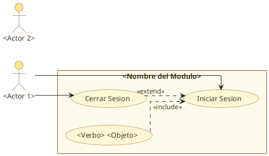
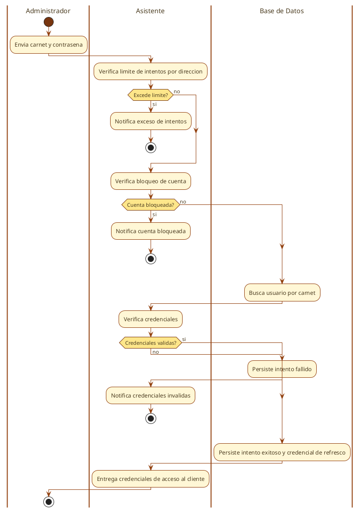
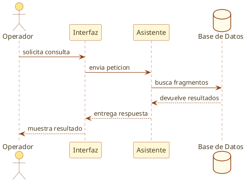

# Plantillas canonicas PlantUML para diagramas UML

Plantillas obligatorias para todos los diagramas UML de la tesis (Sprints 0-6). Aplican Hard Rules 15 (paleta institucional), 16 (sin `title`), 17 (linetype ortho), 18 (actores fuera del package), 19 (Georgia), 20 (swimlane Asistente), 21 (max 10 nodos actividades).

## Reglas comunes a todos los diagramas

- **Sin `title`** dentro del `.puml` (Hard Rule 16). El titulo vive solo en el H2 del `.md`.
- **`skinparam linetype ortho`** para lineas rectas (Hard Rule 17).
- **`skinparam defaultFontName "Georgia"`** y **`skinparam defaultFontColor #4A3B1F`** (Hard Rule 19).
- **Paleta institucional del Tribunal Supremo Militar** (Hard Rule 15):
  - Ambar claro: `#FFF7D6` (fondo acciones/usecase)
  - Ambar medio: `#FDE68A` (fondo actores/decisiones)
  - Ambar muy claro: `#FFFBEB` (fondo rectangle/notas)
  - Marron oscuro: `#78350F` (bordes actores, inicio/fin)
  - Marron medio: `#92400E` (bordes usecase, flechas, swimlanes)
  - Texto: `#4A3B1F` (marron oscuro, no negro)
- **Actores fuera del `package`/`rectangle`** del modulo (Hard Rule 18).
- **Swimlane `|Asistente|`** nunca `|Sistema|` (Hard Rule 20).
- **Nodos en castellano natural**, sin tecnicismos (ver lista de prohibidos abajo).

## Lista de prohibidos en nodos y labels (OBLIGATORIO)

Prohibido en nodos de actividades, labels de usecase, mensajes de secuencia:

- `bcrypt`, `bcrypt.compare`, `bcrypt.hashpw`
- `HTTP 409`, `HTTP 401`, `HTTP 429`, `HTTP 423`, `HTTP 500`, `HTTP 201`, `HTTP 200`
- `ix_usuario_carnet`, `ix_*`, nombres de indices
- `httpOnly`, `Secure`, `SameSite=Strict`, `max_age`
- `INSERT en \`tabla\``, `UPDATE en \`tabla\``, `SELECT`, SQL crudo
- `RateLimitError`, `LockoutError`, `LoginError`, `ReplayError`, `RefreshTokenError`
- `CarnetDuplicadoError`, `UsuarioNoEncontradoError`, nombres de excepciones
- `access_token`, `refresh_token`, `password_hash`, identificadores con guion bajo
- `JWT`, `SHA-256` (usar "credencial de acceso", "huella de la credencial")
- `require_admin`, `require_rol`, nombres de dependencias
- `POST /auth/login`, rutas HTTP
- `(login)`, `(logout)`, parentesis aclaratorios
- `Regla 2`, `Regla 4`, `Regla N`, citas a reglas de seguridad

## Verbos permitidos para labels de `usecase` (OBLIGATORIO)

Solo estos verbos de accion, en castellano, capitalizados la primera letra. Sin parentesis ni tecnicismos.

| Verbo            | Uso tipico                                             |
| ---------------- | ------------------------------------------------------ |
| `Iniciar Sesion` | Autenticacion.                                         |
| `Cerrar Sesion`  | Logout.                                                 |
| `Crear Usuario`  | Alta de usuario.                                        |
| `Crear Norma`    | Carga e indexación de una norma del corpus.             |
| `Listar Usuarios`| Listado.                                               |
| `Listar Normas`  | Listado de normas registradas.                         |
| `Modificar Rol`  | Cambio de rol/perfil.                                   |
| `Cambiar Estado de Cuenta` | Activar/inactivar (nunca "inhabilitar" ni "eliminar"). |
| `Restablecer Contrasena` | Reset password forzado por admin.            |
| `Consultar`      | Consultar Historial, Consultar Obra.                   |
| `Consultar Fragmentos` | Inspección de fragmentos del corpus.              |
| `Ver`            | Ver Estado de Indexacion, Ver Expediente.              |
| `Ver Integridad del Corpus` | Comprobación de consistencia del corpus.       |

Prohibidos: Gestionar, Administrar, Evaluar, Recuperar, Validar, Forzar, Cerrar (sesion si), Realizar, Clasificar, Generar, Ajustar, Resolver, Seleccionar, Editar, Publicar, Sugerir, Extraer, Monitorear, Reconciliar, Indexar, Inhabilitar, Eliminar, Borrar, Tramitar, Manejar, Valorar, Conducir, Refrescar, Resetear.

Los labels de `.puml` conservan tildes y ñ. Para corpus se usa `Crear Norma` en
lugar de `Subir` o `Indexar`, `Consultar Fragmentos` en lugar de `Listar
Fragmentos` y `Ver Integridad del Corpus` en lugar de `Reconciliar Corpus`.

---

## Plantilla 1: Caso de Uso Expandido



### Reglas especificas caso de uso

- `left to right direction` siempre (mejor layout horizontal).
- Actores **antes** del `rectangle`, nunca dentro.
- `rectangle "<Modulo>"` agrupa solo los `usecase`.
- Labels de `usecase` = verbo permitido de la tabla de arriba.
- `<<include>>` para casos obligatorios (ej. `Crear Usuario ..> Iniciar Sesion`).
- `<<extend>>` para casos opcionales (ej. `Cerrar Sesion ..> Iniciar Sesion`).
- `skinparam actorStyle Hollow` opcional si se quiere actor estilo "hueco".

---

## Plantilla 2: Diagrama de Actividades (max 10 nodos)



### Reglas especificas actividades

- **Maximo 10 nodos** entre todas las swimlanes (Hard Rule 21).
- **Un solo flujo principal** por diagrama. Si un sprint tiene dos procesos distintos, cada uno es un diagrama separado.
- **Swimlanes**: `|Administrador|` / `|Asistente|` / `|Base de Datos|` (nunca `|Sistema|`).
- **Nodos en castellano natural**, sin tecnicismos de la lista de prohibidos.
- **Decisiones**: `(si)` / `(no)` en minuscula, sin parentesis adicionales.
- **Notificaciones de fallo como nodo explicito** (ej. `:Notifica exceso de intentos;`).
- Las tres swimlanes se declaran al inicio (antes de `start`) aunque algunas no se usen en el flujo.

---

## Plantilla 3: Diagrama de Secuencia



### Reglas especificas secuencia

- **Maximo 5-6 participantes** (lineas de vida). Conservar solo: actor, interfaz, controlador, servicio principal, base de datos.
- **Mensajes esenciales**: los que recorren el flujo del sprint de punta a punta.
- **Sin notas `Regla N`** embebidas, sin rutas HTTP, sin nombres de archivo, sin parentesis.
- **Mensajes en castellano natural**, sin nombres de variables largos ni siglas internas.
- `skinparam linetype ortho` para flechas rectas.
- Participantes: `actor`, `participant`, `database` (no `entity` ni `boundary`).

---

## Renderizado

```bash
plantuml -tpng archivo.puml
```

Si PlantUML reporta `linetype ortho` no soportado para un tipo de diagrama, usar `linetype polyline` como fallback aceptable (nunca el curvado por defecto).

## Validacion por diagrama

Antes de cerrar cada diagrama, verificar:

- [ ] Sin `title` en el `.puml`
- [ ] `linetype ortho` (o `polyline` fallback)
- [ ] `defaultFontName "Georgia"` y `defaultFontColor #4A3B1F`
- [ ] Paleta institucional aplicada (actores `#FDE68A`, usecase/acciones `#FFF7D6`, rectangle `#FFFBEB`)
- [ ] Actores fuera del `package`/`rectangle`
- [ ] Swimlanes con `|Asistente|` (no `|Sistema|`)
- [ ] Actividades con max 10 nodos
- [ ] Labels/nodos sin tecnicismos de la lista de prohibidos
- [ ] Verbos de usecase solo de la tabla de permitidos
- [ ] Diagrama cabe en una sola pagina al renderizar
